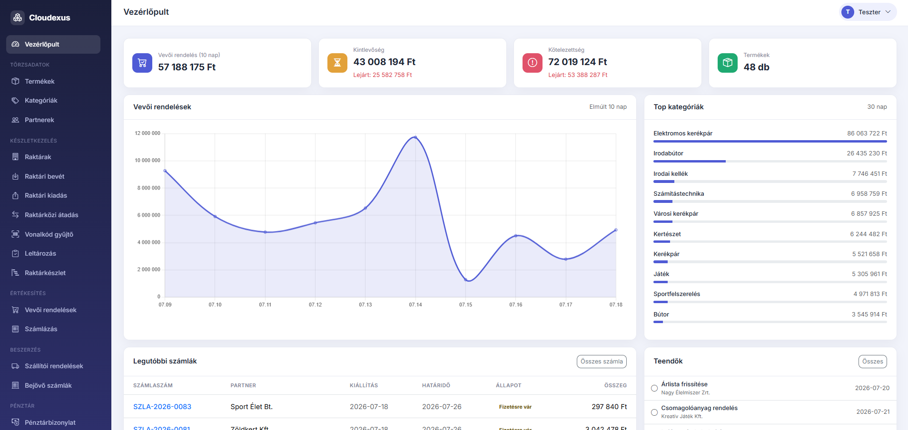

# ☁️ Cloudexus

**Felhő alapú, moduláris ügyviteli és vállalatirányítási rendszer.**

A Cloudexus egy helyen kezeli a teljes kereskedelmi folyamatot: részletes terméktörzs és partnerkezelés, több raktáras készlet- és raktárkezelés vonalkódos rögzítéssel, raktárközi átadással és leltározással, vevői rendeléstől a számlázásig, beszerzéstől a bejövő számláig, pénztár és számlakiegyenlítés, valamint CRM teendők és ügyfélkapcsolat-történet. Mindezt egy letisztult, valós idejű vezérlőpult, keresők, szűrők és riportok fogják össze — kifejezetten nagy raktárkészlettel dolgozó, aktív kereskedelmi tevékenységet folytató vállalkozásokra szabva.




---

## ✨ Fő funkciók

### 📊 Vezérlőpult
- Valós idejű forgalmi grafikon (Chart.js) az elmúlt 10 nap rendeléseiről
- Kintlevőség és kötelezettség kártyák **lejárt / nem lejárt** bontásban, egy kattintásra szűrt listával
- Top termékkategóriák 30 napos értékesítési érték szerint
- Legutóbbi számlák gyorsáttekintés

### 📦 Törzsadatok
- Terméktörzs cikkszámmal, kategóriafával, mennyiségi egységgel, árral és élő készletadattal
- Partnertörzs (vevő / szállító / mindkettő) adószámmal és elérhetőségekkel
- Kereshető, szűrhető, lapozható listák minden modulban

### 🏭 Készletkezelés
- Több raktár és telephely kezelése
- Raktári bevét és kiadás bizonylatolása (túladás elleni védelemmel)
- **Raktárközi átadás** tranzakcionális ki-/bevét párokkal
- Élő raktárkészlet-összesítő raktár- és termékszűrővel
- A készlet mindig a mozgásokból számolódik — konstrukciójából adódóan konzisztens

### 🧾 Értékesítés
- Vevői rendelések dinamikus tételsorokkal, automatikus árkitöltéssel és élő végösszeg-számítással
- Számlázás önállóan vagy **egy kattintással rendelésből** (tételek előtöltve)
- Opcionális automatikus raktári kiadás számlázáskor, készletellenőrzéssel
- Számla-életciklus: fizetésre vár → kifizetve / stornózva, lejárt kiemeléssel

### 🚚 Beszerzés
- Szállítói rendelések és bejövő számlák
- Bejövő számla rögzítésekor **automatikus raktári bevét** a választott raktárba
- Rendelésből előtöltött számlázás a vevői oldallal azonos élménnyel

### 💰 Pénztár
- Bevételi és kiadási pénztárbizonylatok
- Számlához kapcsolt bizonylat = automatikus kiegyenlítés (a számla kifizetetté válik)
- Élő pénzkészlet-egyenleg

### ⚙️ Rendszer
- Bejelentkezés felhasználónévvel vagy e-maillel, bcrypt jelszó-hash
- Szerepkör-alapú jogosultságok (admin / felhasználó), admin felhasználókezelés
- Saját profil és jelszóváltás
- CSRF-védelem minden űrlapon, HttpOnly + SameSite session süti
- Magyar nyelvű felület

---

## 🏢 Működési modell

A Cloudexus az *1 telepítés = 1 cég* modellt követi: minden vállalat a saját, elkülönített példányát futtatja, a felhasználók pedig ugyanazon cég munkatársai. Így nincs bérlők közti adatmegosztás, és a rendszer teljesen az adott vállalat igényeire hangolható.

---

## 🛠️ Technológia

| Réteg | Megoldás |
|---|---|
| Backend | PHP 8.4, egyedi könnyűsúlyú MVC (framework nélkül) |
| Adatbázis | MySQL / MariaDB, PDO prepared statement-ekkel |
| Sablonozás | [Twig 3](https://twig.symfony.com/) |
| Frontend | [Bootstrap 5.3](https://getbootstrap.com/) + [Bootstrap Icons](https://icons.getbootstrap.com/) + [Select2](https://select2.org/) + egyedi CSS design-rendszer |
| Grafikonok | [Chart.js 4](https://www.chartjs.org/) |
| Levelezés | [PHPMailer](https://github.com/PHPMailer/PHPMailer) (tranzakciós e-mailekhez) |

> Minden front-end függőség lokálisan, a `web/assets/vendor/` mappából töltődik be — a rendszer internet nélkül is működik.

A publikus dokumentumgyökér kizárólag a `web/` mappa — minden alkalmazáskód, konfiguráció és futásidejű adat azon kívül él.

## 🚀 Telepítés

**Követelmények:** PHP ≥ 8.4 (`pdo_mysql`), MySQL/MariaDB, Composer, Apache (mod_rewrite).

```bash
# 1. Klónozás
git clone https://github.com/szabolevi98/Cloudexus.git
cd Cloudexus

# 2. Függőségek
composer install

# 3. Konfiguráció
cp config/config.ini.dist config/config.ini
#    → állítsd be az adatbázis-elérést és a base_url-t

# 4. Adatbázis-séma
php database/migrate.php

# 5. Admin felhasználó
php database/create_admin.php admin titkosjelszo

# 6. (Opcionális) Gazdag demo adatok
php database/seed_demo.php
```

Ezután nyisd meg a `config.ini`-ben beállított `base_url`-t (pl. `http://localhost/Cloudexus/web`), és jelentkezz be.

> A `database/seed_demo.php` bármikor újrafuttatható: minden üzleti táblát kiürít (a felhasználókat nem), és valósághű magyar demo adatokkal tölti fel — 48 termék, 19 partner, 3 raktár, 200+ készletmozgás, 45 rendelés számlákkal és kiegyenlítésekkel.

## 📁 Projektstruktúra

```
Cloudexus/
├── config/              # config.ini (gitignore-olt) + .dist sablon
├── database/
│   ├── core/            # sorszámozott SQL migrációk (01_core.sql, …)
│   ├── migrate.php      # migrációfuttató
│   ├── create_admin.php # kezdő admin létrehozása
│   └── seed_demo.php    # újrafuttatható demo-adat generátor
├── src/
│   ├── Core/            # Config, DB, Router, Session, Auth, Csrf, Paginator, …
│   ├── Controller/      # egy controller / erőforrás
│   ├── Model/           # modulonként: Core, Account, Sales, Purchasing, Cash
│   └── View/
│       ├── Twig/        # sablonok (közös layout + modul-nézetek)
│       └── Css/         # rétegzett forrás-CSS (base/layout/components/pages)
├── var/                 # cache + naplók (gitignore-olt)
└── web/                 # publikus gyökér: index.php front controller + assetek
```

## 🗺️ Roadmap

**Kész:**

- [x] Bejelentkezés, szerepkör-alapú jogosultság, felhasználó- és profilkezelés
- [x] Törzsadatok: termékek (vonalkóddal, minimum készlettel), kategóriák, partnerek
- [x] Készletkezelés: bevét, kiadás, raktárközi átadás, raktárkészlet-áttekintés
- [x] Vonalkód gyűjtő (kézi leolvasós tömeges készletrögzítés)
- [x] Leltározás készletkorrekcióval
- [x] Értékesítés: vevői rendelés → számlázás, nyomtatható számla
- [x] Beszerzés: szállítói rendelés → bejövő számla automatikus bevéttel
- [x] Pénztár: bizonylatok, számla-kiegyenlítés, pénzkészlet
- [x] CRM: teendők (feladatlista határidővel, partnerhez/felelőshöz kötve)
- [x] Vezérlőpult: forgalmi grafikon, kintlevőség/kötelezettség, top kategóriák, alacsony készlet, teendők
- [x] Keresés, szűrők, lapozás, CSV export a listákban
- [x] CSRF-védelem, cégadat-beállítások

- [x] Részletes terméktörzs: rövid/hosszú leírás, képek (feltöltés + URL), paraméterek, több kategória, kapcsolódó/helyettesítő termékek, méretek, nettó ár + ÁFA, webshop jelölő
- [x] Tárhely / polc szintű helykódok
- [x] CRM: ügyfélkapcsolat-történet (hívás/e-mail/találkozó napló)

**Következő lépcsők:**

- [ ] Szállítólevelek és fuvarszervezés
- [ ] NAV Online Számla adatszolgáltatás
- [ ] Futárszolgálat-integrációk (GLS, MPL, Foxpost, …)
- [ ] Webshop-integrációk + REST API

**Tudatosan kihagyva** (az *1 telepítés = 1 cég* modell vagy a szűk célközönség miatt): belső licensz-/előfizetés-kezelés, több bérlős (multi-tenant) elkülönítés, bővítménybolt/plugin-marketplace, white-label testreszabás, valamint niche hatósági funkciók (pl. CMR, Intrastat).

## 📄 Licenc

Minden jog fenntartva. © 2026 Cloudexus
